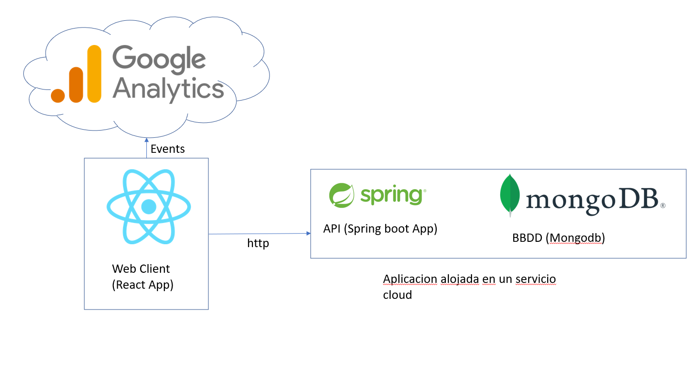
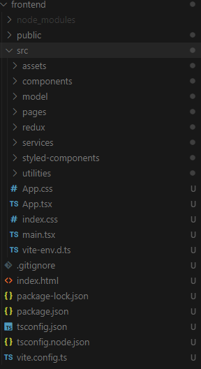
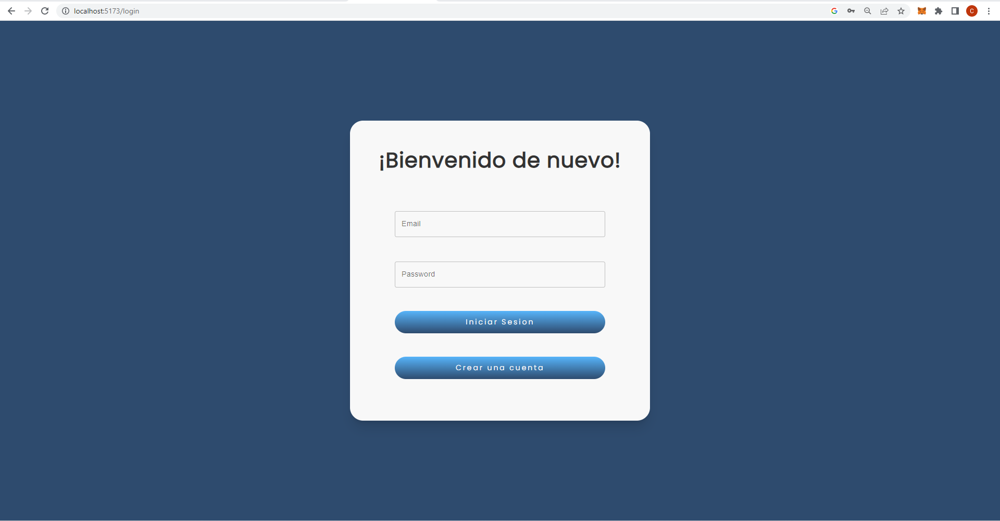
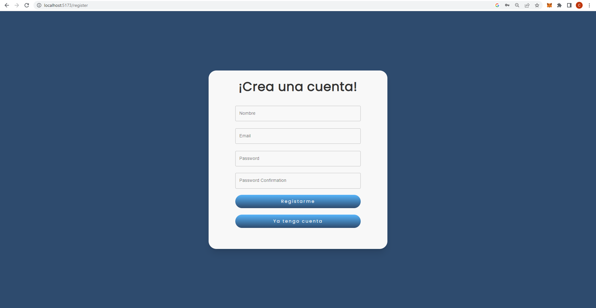
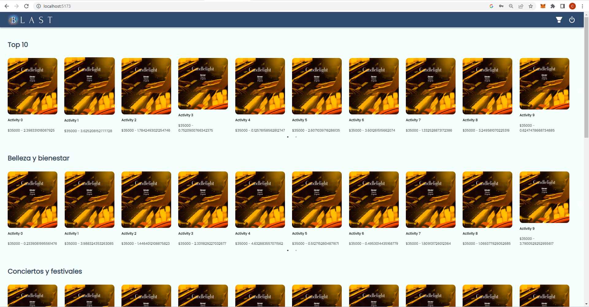
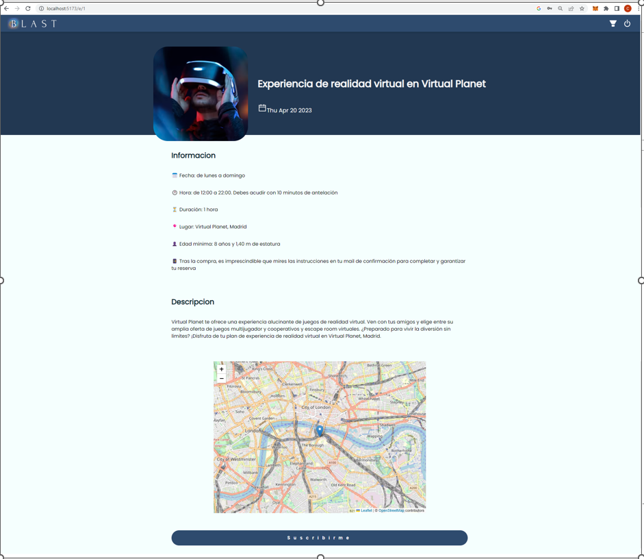
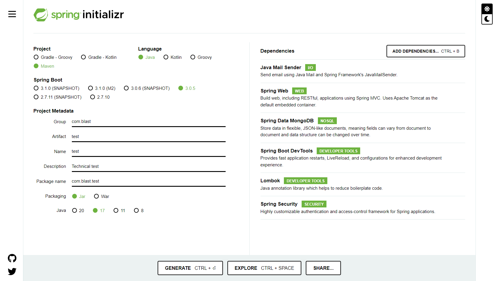
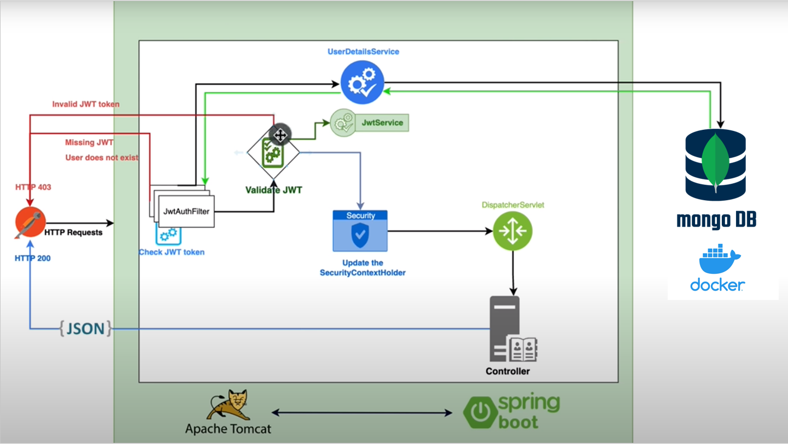
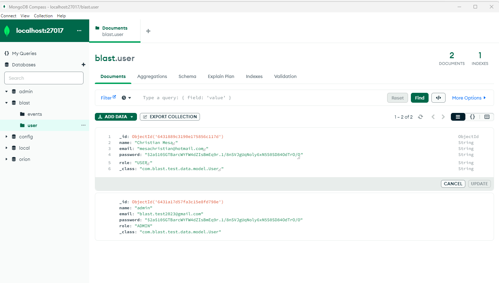

# Blast Technical Test
Esta es una prueba tecnica para el puesto de CTO en BLAST.

# Requerimientos funcionales
- Una solucion que permita la creacion y autenticacion de usuarios.
- La solucion debe tener un portal de experiencias.
- La solucion debe permitir que los usuarios se suscriban a las experencias
- Cuando un usuario se suscriba a la experencia debe recibir un correo con la informacion de esta experencia.
- Debe existir un pixel de trasabilidad para marketing. 

# Descripcion de la solucion
Para solucionar este problema se propone una arquitectura con los siguientes componentes:

- Una aplicacion web escrita en react que permite a los usuarios interactuar con las experiencias y con sus cuentas. La aplicacion web tambien estara encargada de la comunicacion con Google Analytics. Para esta aplicacion web se usa React como framework.

- Una API que permite la creacion de eventos y se encargara de comunicarse con una base de datos para almacenar la informacion necesarioa de usarios y eventos. Tambien el API se encargara de manejar el protocolo SMTP para el envio de correos a los usuarios. Para esta API se usa Spring como framework.

- Una base de datos no relacional. Para esta solucion se usa MongoDB.

A continuacion se muestra un diagrama de la solucion y como se comunican sus elementos:
- 

# Descripcion componentes de la solucion

## Aplicacion Web

Para la aplicacion web se usa React como framework. La arquitectura de esta aplicacion esta inspirada en la Clean architecture.

- 

A pesar que esta idea no fue propuesta inicialmente para frontend se pueden aplicar sus principios. El resultado de esto nos da una estrutura de carpetas de la siguiente forma:

- 

Estas carpetas cumple con los principios de SoC (Separation of concerns).

La aplicacion web cuenta con 4 pantallas:

Las primeras dos son para la creacion de una cuenta e inicio de sesion.

### Inicio de sesion
- 

### Creacion de cuenta
- 

Para estos formularios se uso la libreria [React Hook Form](https://react-hook-form.com/) la cual permite la entrada de datos de manera dinamica y su verificacion en tiempo real. Asi se verifica que el formato del correo y contraseñas sea el correcto.

Para gestionar el estado global de la aplicacion se escogio [React Redux](https://react-redux.js.org/). Con el API se maneja una autenticacion mediante un token JWT. Una vez el API responda con este token. Este sera almacenado en el estado global de la web app.

A continuacion se muestra la parte del codigo que es encargada del almacenar el estado de autenticacion y las funciones que se pueden llamar sobre este estado.

```typescript
import { createSlice } from '@reduxjs/toolkit';

const initialState = {
    email: '',
    token: ''
}

export const authSlice = createSlice({
    name: 'auth',
    initialState: initialState,
    reducers: {
        saveSession: (state, action) =>  action.payload,
        deleteSession: () => initialState
    }
});

export const { saveSession, deleteSession } = authSlice.actions;

export default authSlice.reducer;
```

La siguiente pantalla es el dashboard de experencias:

- 

Este dashboard consulta el API pidiendo eventos de las siguientes categorias:
- TOP 10
- Gastronomía
- Conciertos y festivales
- Cultura,arte y moda
- Belleza y bienestar
- Atracciones, tour y viajes

Y los muestra en forma de sliders.

Cuando el usuario haga click en alguno de estos eventos se envia a google analytics un evento donde se registra el email del usuario y el id del evento el cual se abrio. Paso seguido se despliega la ultima pantalla donde se muestra a detalle la informacion del evento:

- 

Esta pantalla muestra informacion del evento y se usa la librearia [React Leaflet](https://react-leaflet.js.org/) para pintar un mapa con la ubicacion del evento en el mapa de la ciudad. Esta libreria se uso por encima de google maps por que es de software libre, no requiere pagos y se ajusta a la solucion propuesta.

Si el usuario se suscribe al evento se envia automaticamente un correo indicandole a que evento se suscrbio.

## API

Para la creacion de esta API se uso [Spring Initializr](https://start.spring.io/).

- 

Las dependecias de spring que necesitamos son las siguientes:
- Java Mail Sender: Dependencia que ayuda a implementar el protocolo SMTP para el envio de correos a los usuarios
- Spring Web: Dependencia para la creacion de una REST API que usan JSON para la entrada y salida de datos mediante protocolo HTTP.
- Spring Data MongoDB: Dependencia usada en la capa de datos para la conexion con bases de datos de mongo. Definicion de repositorios y documentos.
- Spring Boot Dev Tools: Herramienta para desarrollar con mas comodidad, personalmente uso las funciones de HotReload.
- Lombok: Dependencia para reducir el boilerplate code a unas anotaciones
- Spring Security: Dependencia para manejar la seguridad de la aplicacion.

Lo primero que se realizo en el API fue el registro de usuarios. Para esto se implemento la siguiente arquitectura:

- 

Basicamente esta arquitectura toma cada peticion y la pasa por un middleware que extrae el token de autenticacion del header del request y si la informacion de este token es veridica se despecha el request a los controladores de la aplicacion.

Anexo a continuacion el codigo para la configuracion de la seguridad en la aplicacion:

```java
    @Bean
    public SecurityFilterChain securityFilterChain(HttpSecurity http) throws Exception{
        http
                .csrf()
                .disable()
                .authorizeHttpRequests( auth -> auth
                        .antMatchers("/api/v1/auth/**").permitAll()
                        .anyRequest().authenticated()
                )
                .sessionManagement()
                .sessionCreationPolicy(SessionCreationPolicy.STATELESS)
                .and()
                .authenticationProvider(authenticationProvider)
                .addFilterBefore(jwtAuthenticationFilter, UsernamePasswordAuthenticationFilter.class);
        return http.build();
    }
```

Aca se puede ver como se habilitan los endpoints del controlador de autenticacion ya que login y registro no necesitan token para ser usados. Ademas la api no maneja sesiones. Cada peticion debe ser stateless de acuerdo a los principios REST. Tambien se ve como se pasa la cadena de filtros con la comprobacion de los JWT y se usa una autenticacion usando correo y contrasena del usuario.

Existen dos tipos de usuarios el ADMIN y el USER. El usuario ADMIN es el unico que puede crear eventos. Este usuario debe crearse directamente en base de datos. Y el usuario corriente que se crea desde la peticion que genera el web app. A continuacion usando mongo compas muestro como se deben ver esta coleccion en bbdd.

- 

Un detalle que se puede ver es lo largo de las contraseñas esto es debido a que antes de almacenarlas en bbdd estas contraseñas son encriptadas para hacer un manejo correcto de los datos de los usuarios y evitar exponer sus datos ante posibles ataques a la bbdd.

### Configuracion SMTP

Para el envio de correos hay que configurar lo que se necesita del protocolo SMTP en la dependencia Java Mail Sender. Esto se hace puntualmente en el archivo applcation.properties. La configuracion que se uso es la siguiente:

```
# SMTP
spring.mail.host=smtp.gmail.com
spring.mail.port=587
spring.mail.username=blast.test2023@gmail.com
spring.mail.password=##############
spring.mail.properties.mail.smtp.auth=true
spring.mail.properties.mail.smtp.starttls.enable=true
```

Para poder usar este servicio cree una cuenta de google y le di permisos de desarrollador para usar gmail como proveedor de los servicios SMTP. Tambien obtuve una llave de desarrollador la cual va en el campo de password. Esta llave permite la utenticacion de la cuenta de gmail. Defini el puerto del computador por el cual se establece la comunicacion con los servicios de gmail y el resto fue usar inyeccion de dependendencias en la clase que me da la dependencia

```java
@Autowired
private JavaMailSender javaMailSender;
```

### Base de datos

Mongodb se eligio como provedor de base de datos debido a su buena escalabilidad. A sus altas velocidades. Una base de datos no relacional en esta etapa temprana del proyecto de muy buena eleccion ya que no estamos ligados a provedoores de bases de datos como oracle que presentan muchos problemas. Estas bases de datos permiten desarrollos flexibles, simples y muy escalables. Son muy sencillas de conteinerizar usando doker lo cual permite buena escalabilidad horizontal en provedoores clous como AWS, Google Cloud o Azure.